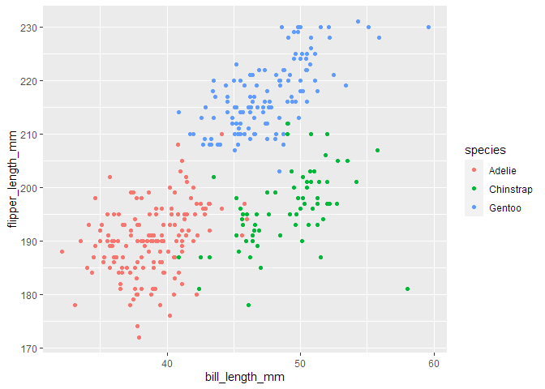

P8105_hw1
================
Yang Xie
2023-01-02

**Load Pckages**

``` r
library(tidyverse)
```

### Problem 1

Load the penguins data set and give a short description using inline R
code:

``` r
data("penguins", package="palmerpenguins")

penguins
```

    ## # A tibble: 344 × 8
    ##    species island    bill_length_mm bill_depth_mm flipper_…¹ body_…² sex    year
    ##    <fct>   <fct>              <dbl>         <dbl>      <int>   <int> <fct> <int>
    ##  1 Adelie  Torgersen           39.1          18.7        181    3750 male   2007
    ##  2 Adelie  Torgersen           39.5          17.4        186    3800 fema…  2007
    ##  3 Adelie  Torgersen           40.3          18          195    3250 fema…  2007
    ##  4 Adelie  Torgersen           NA            NA           NA      NA <NA>   2007
    ##  5 Adelie  Torgersen           36.7          19.3        193    3450 fema…  2007
    ##  6 Adelie  Torgersen           39.3          20.6        190    3650 male   2007
    ##  7 Adelie  Torgersen           38.9          17.8        181    3625 fema…  2007
    ##  8 Adelie  Torgersen           39.2          19.6        195    4675 male   2007
    ##  9 Adelie  Torgersen           34.1          18.1        193    3475 <NA>   2007
    ## 10 Adelie  Torgersen           42            20.2        190    4250 <NA>   2007
    ## # … with 334 more rows, and abbreviated variable names ¹​flipper_length_mm,
    ## #   ²​body_mass_g

-   The data set penguins has 344 rows and 8 columns.

-   The data set contains variables: species, island, bill_length_mm,
    bill_depth_mm, flipper_length_mm, body_mass_g, sex, year.

-   The mean flipper length is 200.9152047.

``` r
penguins %>%
  ggplot()+
  geom_point(aes(x=bill_length_mm, y=flipper_length_mm, color=species))
```

<!-- -->

``` r
ggsave('scatterplot Q1.jpg')
```

### Problem 2

``` r
set.seed(1)

new_df <- tibble(
  vector_num = rnorm(10),
  vector_log = vector_num > 0,
  vector_char = letters[1:10],
  vector_fac = factor(c("A", "B", "c","A", "B", "c","A", "B", "c", "A"))
)

new_df
```

    ## # A tibble: 10 × 4
    ##    vector_num vector_log vector_char vector_fac
    ##         <dbl> <lgl>      <chr>       <fct>     
    ##  1     -0.626 FALSE      a           A         
    ##  2      0.184 TRUE       b           B         
    ##  3     -0.836 FALSE      c           c         
    ##  4      1.60  TRUE       d           A         
    ##  5      0.330 TRUE       e           B         
    ##  6     -0.820 FALSE      f           c         
    ##  7      0.487 TRUE       g           A         
    ##  8      0.738 TRUE       h           B         
    ##  9      0.576 TRUE       i           c         
    ## 10     -0.305 FALSE      j           A

**Calculating the mean of variables in the dataframe**

``` r
vnum <- pull(new_df, var = 1)
mean(vnum)
```

    ## [1] 0.1322028

``` r
vlog <- pull(new_df, var = 2)
mean(vlog)
```

    ## [1] 0.6

``` r
vchar <- pull(new_df, var = 3)
mean(vchar)
```

    ## Warning in mean.default(vchar): 参数不是数值也不是逻辑值：回覆NA

    ## [1] NA

``` r
vfac <- pull(new_df, var = 4)
mean(vfac)
```

    ## Warning in mean.default(vfac): 参数不是数值也不是逻辑值：回覆NA

    ## [1] NA

**Converting the type for non-numeric variables**

``` r
vlog <- as.numeric(vlog)
mean(vlog)
```

    ## [1] 0.6

``` r
vchar <- as.numeric(vchar)
```

    ## Warning: 强制改变过程中产生了NA

``` r
mean(vchar)
```

    ## [1] NA

``` r
vfac <- as.numeric(vfac)
mean(vfac)
```

    ## [1] 1.9

-   Only logical and factor typed values are converted into numeric.
    Character values cannot be converted.

    1.  For logical values, the `as.numeric` function converts every
        TRUE to 1 and converts every FALSE to 0.
    2.  For factor values, the `as.numeric` function converts each
        unique factor level to a integer begins at 1. In our case, three
        factor levels “A”, “B”, “C” are converted to 1, 2, 3
        respectively.
    3.  However, we can not convert character values using `as.numeric`
        function. All we get are NAs.
